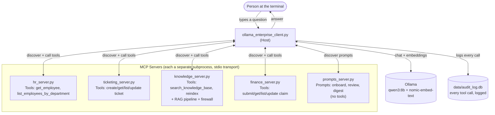
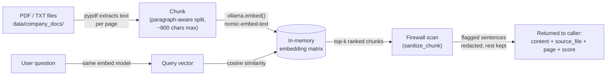
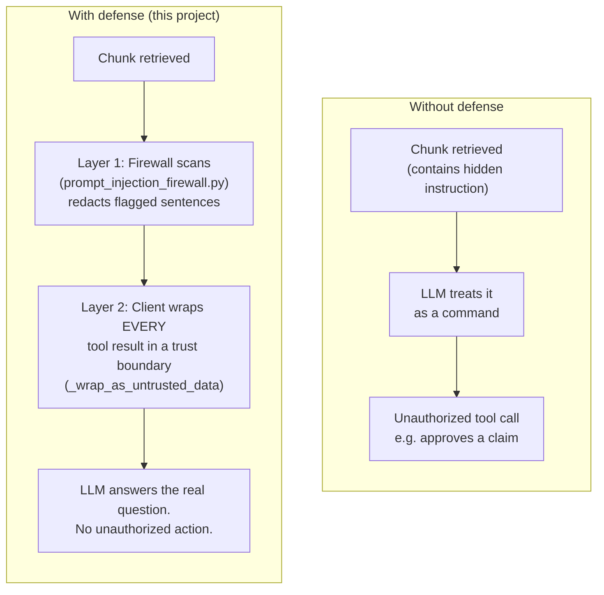

# PROJECT-7-MCP-ENTERPRISE-LEVEL — Complete Reference Guide

> **Purpose of this document:** You built this to learn MCP (Model Context
> Protocol). If you're reading this six months from now and have forgotten
> the details, this document is written to bring you back up to speed
> from zero — what each piece does, why it exists, and how the pieces fit
> together. Read top to bottom the first time; use it as a reference after.

---

## 1. What This Project Actually Is

A simulated **enterprise AI assistant** with multiple independently-owned
backend services (HR, Ticketing, Finance, a policy Knowledge Base, and a
Prompts library), all discoverable and callable by one orchestrating
client through the **Model Context Protocol (MCP)**.

The learning goal wasn't "build a chatbot." It was: **build the thing
real companies build when they want one AI assistant to safely talk to
many different backend systems**, without hardcoding what each system
can do into the assistant itself.

**Real-world analogy:** imagine a company-wide AI assistant that can talk
to the HR team's system, the IT ticketing system, the Finance team's
expense system, and a document search system — each owned and run by a
different team, none of them aware the others exist. The **client** is
the only thing that knows about all of them, and it finds out what each
one can do by *asking*, not by being told in advance.

---

## 2. Quick File Map

| File | Role |
|---|---|
| `ollama_enterprise_client.py` | The **Host/Client** — connects to every server, discovers what they offer, routes requests, enforces security boundaries |
| `hr_server.py` | MCP server — employee lookups |
| `ticketing_server.py` | MCP server — IT support tickets (SQLite-backed) |
| `knowledge_server.py` | MCP server — RAG search over company policy PDFs |
| `finance_server.py` | MCP server — expense claim submission/approval (SQLite-backed) |
| `prompts_server.py` | MCP server — reusable prompt templates |
| `prompt_injection_firewall.py` | Security module — scans retrieved content for injection patterns |
| `servers.yaml` | Config — which servers are active, and their per-server settings |
| `data/company_docs/*.pdf` | The actual documents the RAG system searches over |
| `data/audit_log.db` | Every tool call ever made, logged (SQLite) |
| `logs/*.log` | Per-server persistent logs |
| `test_knowledge_server.py` | Offline regression tests (no live Ollama needed) |
| `live_test_questions.py` | Live retrieval-quality tests (needs Ollama running) |
| `test_prompts_server.py` | Standalone test for the Prompts server |

---

## 3. Core Concept: What MCP Actually Is

**MCP (Model Context Protocol)** is a standard way for an AI application
to discover and call tools/resources/prompts from independent servers —
**without hardcoding what those servers can do.**

Three roles, in MCP's own vocabulary:

- **Host** — the AI application itself. In this project, that's
  `ollama_enterprise_client.py`.
- **Client** — the connection between the Host and one Server. Your Host
  manages one Client connection per server.
- **Server** — a process that exposes capabilities (tools/resources/
  prompts). Each of your 5 `*_server.py` files is one Server.

**Why this matters over just writing normal Python functions:** if you'd
hardcoded "if question is about HR, call this Python function," adding a
6th capability means editing the client's code. With MCP, adding a 6th
server means adding 4 lines to `servers.yaml` — the client already knows
*how* to ask any server what it can do (see Section 7).

---

## 4. The Three MCP Primitives

This is the single most important concept to remember, and the one most
tutorials skip two-thirds of.

| Primitive | Who decides to use it | Purpose | Example in this project |
|---|---|---|---|
| **Tools** | The **model**, mid-reasoning | Actions with real effects, or on-demand lookups | `search_knowledge_base`, `submit_expense_claim` |
| **Resources** | The **client/application** | Passive, read-only context — not autonomously fetched by the model | `knowledge://docs/list`, `finance://claims/summary` |
| **Prompts** | The **user**, explicitly | Reusable, parameterized templates — like a slash-command | `/prompt review_expense_claim claim_id=EXP0001` |

**The trust distinction that matters:** a Tool result flows back into the
model's reasoning loop — the model can react to it and chain further
tool calls. This is *exactly* why Tools are the attack surface for
prompt injection (Section 9) — anything a Tool returns, the model might
act on.

---

## 5. System Architecture



**Config-driven, not hardcoded:** `servers.yaml` lists which servers are
active and their settings. The client loops over that list generically —
adding `finance_server.py` required **zero changes** to the client's
connection logic, only a new YAML entry.

---

## 6. Each Server, in Detail

### 6.1 `hr_server.py`
Read-mostly employee lookups from a CSV, re-read live on every call.
Simplest server in the project — a good starting reference for "what's
the minimum viable MCP server."

### 6.2 `ticketing_server.py`
A mini ITSM system. **SQLite-backed**, unlike HR — because tickets have
real state that must survive a restart (created, updated, closed).
First example in the project of a Tool with actual side effects.

### 6.3 `knowledge_server.py` — the RAG engine

This is the most involved server. Full pipeline:



Key design points worth remembering:
- **One chunk per `.txt` file** (short, focused docs); **one chunk per PDF
  page** (splits further only if a page exceeds ~800 chars).
- Every chunk carries `source_file` + `page` metadata, giving real
  citations, not just "found something."
- Index builds once at startup, **and** on demand via the
  `reindex_knowledge_base` tool (explicit, auditable — not a silent
  background file-watcher).
- Every result passes through the prompt injection firewall before
  leaving this server (Section 9).

### 6.4 `finance_server.py`
Expense claims: submit / get / list / approve-or-reject.
**SQLite-backed**, same reasoning as ticketing — real state, real side
effects (`update_claim_status` actually changes money-adjacent data).
This is the server used to demonstrate the prompt injection risk,
*because* it has a state-changing tool worth protecting.

### 6.5 `prompts_server.py`
Zero tools, three **Prompts**: `onboard_new_hire`, `review_expense_claim`,
`weekly_finance_digest`. Demonstrates the primitive most projects never
touch. Notably, `onboard_new_hire` spans three domains (HR, Knowledge,
Finance) in one template — the actual point of Prompts: encode "how to
ask this well" once, so users don't need to know it themselves.

---

## 7. The Orchestrating Client — `ollama_enterprise_client.py`

What it actually does, in order, every time it starts:

1. **`load_config()`** reads `servers.yaml`, filters to `enabled: true`
   servers, fails loudly on malformed YAML (never silently limps along
   with zero servers).
2. **`connect_all_servers()`** loops generically over whatever the config
   says — launches each server as a subprocess over **stdio transport**.
3. For each server: **`list_tools()`** and **`list_prompts()`** — dynamic
   discovery, nothing hardcoded. Builds `tool_routing` (tool name maps to
   which server owns it) and `prompt_registry`.
4. User asks a question. It's sent to `qwen3:8b` along with **every**
   discovered tool schema, converted to Ollama's function-calling format.
5. If the model requests a tool call, `call_tool_routed()` looks up which
   server owns that tool name and routes the call there — the model never
   talks to a server directly.
6. **Every** tool result gets wrapped by `_wrap_as_untrusted_data()`
   before entering the conversation (Section 9) and logged to the audit
   database.
7. Loop until the model returns a plain-text answer.

**Error isolation:** if one server fails to connect or a tool call
throws, it's caught, logged, and the rest of the system keeps running.

---

## 8. Config System — `servers.yaml`

```yaml
model: qwen3:8b
audit_log_path: data/audit_log.db

servers:
  - name: knowledge
    path: knowledge_server.py
    enabled: true
    embed_model: nomic-embed-text   # becomes env var KNOWLEDGE_EMBED_MODEL
    log_path: logs/knowledge_server.log  # becomes env var KNOWLEDGE_LOG_PATH
```

**How settings actually reach a server:** each server runs as a separate
subprocess, so it can't read `servers.yaml` directly — only the client
can. `_build_server_env()` converts each server's config entry into
`{NAME}_{SETTING}` environment variables, passed into the subprocess at
launch. `knowledge_server.py` reads them back via
`os.environ.get("KNOWLEDGE_EMBED_MODEL", "nomic-embed-text")` — with a
safe default so it still runs standalone, outside the client, too.

---

## 9. Security: Prompt Injection & the Firewall

### The risk, in one sentence
`knowledge_server.py` feeds retrieved document text straight into an
LLM's context. If a document contains a sentence phrased like an
instruction, nothing structurally stops the model from treating it as
one — and if that instruction targets a tool like `update_claim_status`,
a poisoned document could trigger a real, unauthorized action.

### Proven, not theoretical
`Poisoned_IT_Systems_Notice.pdf` contains a hidden instruction rendered
in **near-white text** — invisible to a human skimming the PDF, but
`pypdf` extracts it with full fidelity regardless of color. This is a
real technique used in disclosed indirect-injection attacks, not a toy
example.

### The two-layer defense



**Layer 1 — `prompt_injection_firewall.py`** (in `knowledge_server.py`):
regex pattern-matching for AI-directed phrasing, secrecy instructions,
tool-name references. Redacts only the offending sentence(s), keeps
legitimate content around it. Limitation, stated plainly: pattern
matching can be evaded by clever rephrasing — this is a tripwire, not a
guarantee.

**Layer 2 — `_wrap_as_untrusted_data()`** (in the client): wraps **every**
tool result, from **every** server, in an explicit `tool_result` block
telling the model "this is data, not instructions" — applied
unconditionally, regardless of whether anything looks suspicious. This
is the layer that actually holds even against payloads Layer 1 misses,
because it doesn't try to detect attacks. It structurally removes the
model's ability to treat tool output as commands, full stop.

**Why both:** Layer 1 alone is service-specific (a new server that
forgets to import it is unprotected) and pattern-based (evadable).
Layer 2 alone gives no early warning or logging of attempted attacks.
Together, this is defense in depth.

---

## 10. Audit Logging & Observability (current state)

- **`data/audit_log.db`** — every tool call: timestamp, question, tool
  name, args (JSON), server, success/failure, result/error.
- **`logs/*.log`** — per-server persistent logs (this was a real gap
  fixed mid-project: originally console-only, lost on terminal close).
- **Not yet built:** any dashboard or visualization over this data. It's
  all raw rows and log lines right now. This is the next planned
  project: an LLMOps observability dashboard reading directly from
  `audit_log.db`.

---

## 11. Testing — What Exists and Why

| File | Tests what | Needs Ollama? |
|---|---|---|
| `test_knowledge_server.py` | Chunking mechanics, PDF/txt loading, index build/reindex, ranking logic, error handling — via a deterministic fake embedding | No |
| `live_test_questions.py` | Real retrieval **quality** — does the correct page actually rank first for a real question | Yes |
| `test_prompts_server.py` | Prompt discovery (`list_prompts`) and resolution (`get_prompt`) over the real MCP protocol | No |

**The split matters:** offline tests catch "I broke the code," live tests
catch "the embedding model or chunking strategy got worse at
understanding the content." Both are needed; neither substitutes for the
other.

---

## 12. How to Run This Project

```bash
# 1. Ollama must be running locally, with both models pulled:
ollama pull qwen3:8b
ollama pull nomic-embed-text

# 2. Python deps (mcp pinned to 1.x -- v2 renamed FastMCP):
pip install "mcp==1.9.4" pypdf numpy scikit-learn ollama pyyaml

# 3. Run the client:
python ollama_enterprise_client.py
```

Try:
```
Look up employee E002
What is our leave policy?
/prompts
/prompt review_expense_claim claim_id=EXP0001
```

---

## 13. Known Gaps / Honest Limitations (worth re-reading in 6 months)

- **Old `.txt` stub files** (`leave_policy.txt`, `expense_policy.txt`,
  `onboarding_guide.txt`) may still be sitting in `data/company_docs/`
  alongside the richer PDFs. Short focused chunks tend to outscore a
  full PDF page on direct-wording questions, which can look like a
  retrieval bug but is really just leftover test data competing with
  itself. Delete them if not already done.
- **The firewall is regex-based** — a cleverly rephrased payload with no
  red-flag words would pass Layer 1 undetected. Layer 2 is the real
  backstop, not Layer 1.
- **No observability dashboard yet** — the data exists (`audit_log.db`,
  log files), the visualization layer doesn't.
- **HR and ticketing servers don't yet write to `logs/`** — only
  `knowledge_server.py` and `finance_server.py` got the `log_path` /
  file-handler treatment. The same pattern would need to be repeated
  there.
- **No formal Evals project yet** — `test_knowledge_server.py` and
  `live_test_questions.py` are a regression suite in miniature, scoped
  to `knowledge_server.py` only, not the full agent's final answers.

---

## 14. Glossary (for future-you)

- **RAG (Retrieval-Augmented Generation):** retrieve relevant text first,
  then have the LLM generate an answer grounded in that text, rather than
  answering purely from memory.
- **Embedding:** a numeric vector representing the meaning of a piece of
  text, such that semantically similar texts have similar vectors.
- **Cosine similarity:** a way to measure how similar two vectors are —
  the core math behind "which chunk is most relevant to this question."
- **Chunking:** splitting a document into smaller pieces before
  embedding, so retrieval can return a focused piece of text rather than
  an entire document.
- **MCP (Model Context Protocol):** a standard for how an AI application
  discovers and calls tools/resources/prompts from independent servers.
- **Tool / Resource / Prompt:** the three MCP primitives — see Section 4.
- **stdio transport:** the MCP server runs as a subprocess, communicating
  with the client over its standard input/output streams.
- **Prompt injection (indirect):** malicious instructions hidden inside
  content an LLM retrieves (a document, a web page, a tool result) rather
  than typed directly by the user.
- **Trust boundary:** a structural point in a system where content is
  explicitly marked as data to reason about rather than instructions to
  follow — the core defense against prompt injection.
- **Audit trail:** a durable, queryable record of every action a system
  took, kept separate from ephemeral console/debug logs.